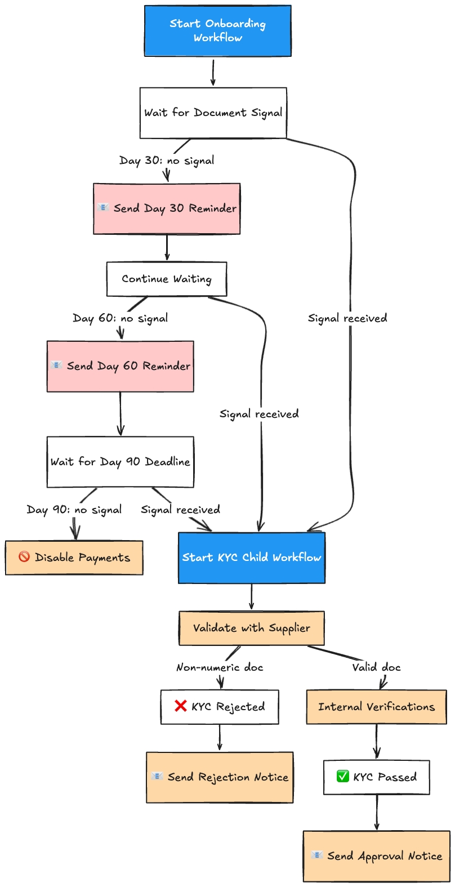

# Customer Onboarding Workflow with Temporal

A Temporal application modeling a merchant onboarding compliance process. When a merchant's first payment arrives, they can process payments immediately but must complete Know-Your-Customer (KYC) verification within 90 days or payments are disabled.

> Inspired by [Mollie Payments' adoption of Temporal](https://youtu.be/5bc3MXuZTRc?si=F6FuWe8b_ioc97m6) for long-running onboarding workflows across European financial services.

## Overview



**Timeline:**
- **Day 0** — Workflow starts when the merchant's first payment is received
- **Day 30** — Reminder sent if document not yet submitted
- **Day 60** — Second reminder
- **Day 90** — Deadline: if no document submitted, payments are disabled

If the merchant submits their document at any point, the reminders stop and KYC verification begins via a child workflow.

## How Temporal Solves Challenges

| Challenge | Temporal Feature | Impact |
|---|---|---|
| Long-running state across 90 days | **Durable Timers** | No cron jobs, no polling — timers survive crashes and restarts |
| Unreliable third-party KYC APIs | **Activity Retries & Timeouts** | Automatic retry with backoff; clean separation from business logic |
| Waiting for async user input | **Signals** (`SignalDocumentSubmitted`) | Workflow sleeps until event arrives — no polling, no message queues |
| Race conditions (signal vs. timer) | **Selectors** | Timers and signals race cleanly; no distributed locks needed |
| Querying workflow state | **Queries** (`QueryOnboardingStatus`) | Real-time status without an external database |
| Isolating failure domains | **Child Workflows** | KYC verification has its own retry policy and lifecycle |
| Business vs. infrastructure errors | **Non-Retryable Errors** | Supplier rejections fail fast; transient errors retry automatically |

## Project Structure

```
├── activities/          # Activity methods on Activities struct
│   ├── activities.go    # Struct definition (DI receiver)
│   ├── notification.go  # SendReminder
│   ├── payment.go       # DisablePayments
│   └── verification.go  # ValidateWithSupplier, PerformInternalVerifications
├── workflows/
│   ├── onboarding.go    # Parent: reminders → deadline → KYC (struct-based)
│   ├── identity.go      # Child: supplier validation → internal checks
│   └── activities.go    # Package-level activity reference
├── workers/
│   ├── onboarding/      # Workflow worker
│   └── activity/        # Activity worker
├── starter/             # Interactive CLI
├── shared/              # Models, constants, task queues
└── tests/               # 11 unit tests with mocked activities
```

## Design Decisions & Best Practices

- **Workflow ID as idempotency key** — `onboard-merchant-{id}` uses a meaningful business identifier to prevent duplicate onboarding for the same merchant.
- **Child workflow for KYC** — Isolates verification with its own retry policy and timeout. Can be reused for annual re-verification without duplicating logic.
- **Business outcomes as return values** — KYC rejection returns `VerificationResult{Passed: false}`, not a workflow error. `NonRetryableApplicationError` is used to distinguish business rejections from transient failures.
- **Signals for external events** — Signals deliver data into a running workflow without polling a database or queue.
- **Queries for state, not a database** — Workflow state is already durable. Expose it via query handlers instead of writing to an external store.
- **Selectors to race timers against signals** — Lets the workflow respond immediately to events instead of waiting for a timer to expire.
- **Separate workflow and activity workers** — Workflow worker is CPU-light (timers/signals); activity worker is I/O-bound (API calls). Scale independently in production.
- **Struct-based activities for dependency injection** — Register activities on a struct so dependencies can be injected at startup and swapped in tests.
- **Logging via `workflow.GetLogger`** — Uses the Temporal SDK logger for determinism-safe, replay-aware logging inside workflows.

## Getting Started

### Prerequisites
- Go 1.21+
- [Temporal CLI](https://docs.temporal.io/cli) (`brew install temporal`)

### Run

```bash
# Terminal 1: Temporal dev server
temporal server start-dev

# Terminal 2: Workflow worker
go run ./workers/onboarding/main.go

# Terminal 3: Activity worker
go run ./workers/activity/main.go

# Terminal 4: Interactive CLI
go run ./starter/main.go
```

**Demo paths:**
- Submit a **numeric** document → KYC passes → `APPROVED`
- Submit a **non-numeric** document → supplier rejects → `KYC-REJECTED`
- Don't submit → reminders fire at Day 30/60 → deadline expires → `PAYMENTS-DISABLED`

### Test
```bash
go test ./tests/ -v
```

### Observe
Open http://localhost:8233 to view workflow execution, event history, and query results in the Temporal Web UI.
